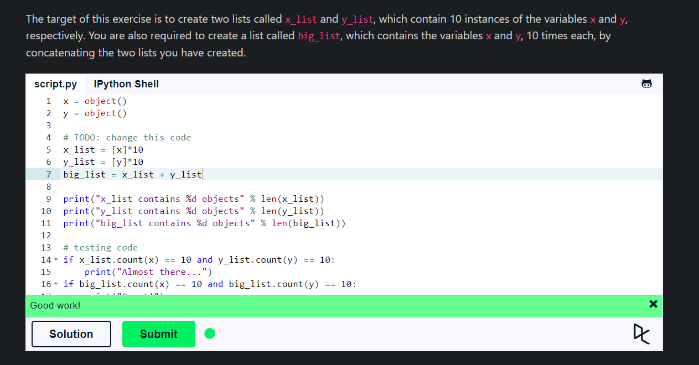

## **Introduction to Python**
Python is a very simple language, and has a very straightforward syntax which helps to program without boilerplate code.

There are two (2) major Python Versions:-
1) Python 2
2) Python 3

One difference between Python 2 and 3 is the print statement. In Python 2, the "print" statement is not a function, and therefore it is invoked without parentheses. However, in Python 3, it is a function, and must be invoked with parentheses.

## **Hello, World**


```
print("Hello, World!")

x=1
if x==1:
    #indented four spaces/one tab
    print("x is 1")

```
- Python uses indentation for blocks, instead of curly braces. Both tabs and spaces are supported, but the standard indentation requires standard Python code to use four spaces.

](image-1.png)

### **Variables & Data Types**

- Integers, floating point numbers and complex numbers falls under Python numbers category. They are defined as int, float and complex class in Python.

- Strings are defined either with a single quote or a double quotes. The difference between the two is that using double quotes makes it easy to include apostrophes (whereas these would terminate the string if using single quotes)

- Mixing operators between numbers and strings is not supported.


### **Lists**

- Lists are the most versatile of Python's compound data types. A list contains items separated by commas and enclosed within square brackets ([]).

- Append is used to add an element to the end of the list.

- Accessing an index which does not exist generates an exception (an error).

- Negative indexing starts from the end.

- Slicing returns a new list.

- Lists are mutable, meaning, value of elements of a list can be altered.

- Nested lists are accessed using nested indexing.


### **Operators**

- Just as any other programming languages, the addition, subtraction, multiplication, and division operators can be used with numbers.

- Follows the BODMAS rule.

- Eval(), which is a built-in function in Python, is used to evaluate the value of a string.

- In Python 3, the division operator / always performs floating-point division and returns a float, even if both operands are integers. This behavior ensures that the result retains any fractional part.

- Python supports concatenating strings using the addition operator.



## **Summary:**
- Python is a very simple language, and has a very straightforward syntax which helps to program without boilerplate code.
- Python uses indentation for blocks, instead of curly braces. Both tabs and spaces are supported, but the standard indentation requires standard Python code to use four spaces or one tab.
- Integers, floating point numbers and complex numbers falls under Python numbers category. They are defined as int, float and complex class in Python.
- Strings are defined either with a single quote or a double quotes.
- Lists are the most versatile of Python's compound data types. A list contains items separated by commas and enclosed within square brackets ([]).
- Just as any other programming languages, the addition, subtraction, multiplication, and division operators can be used with numbers.
