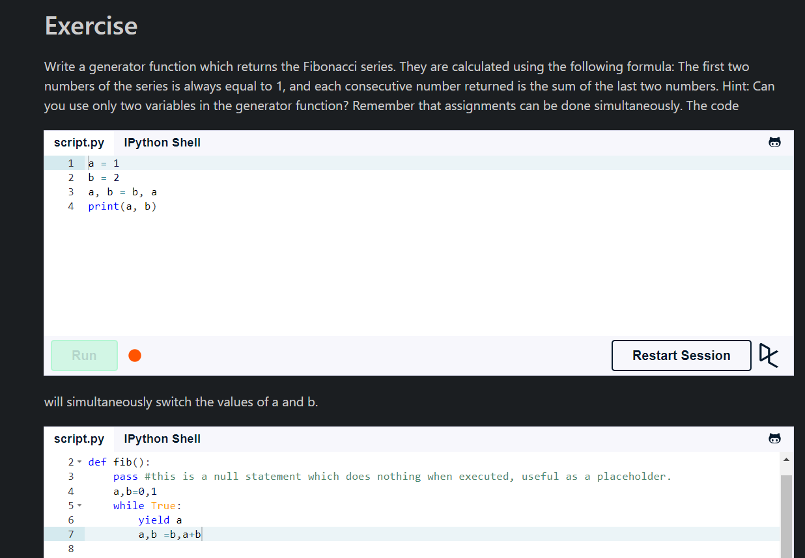
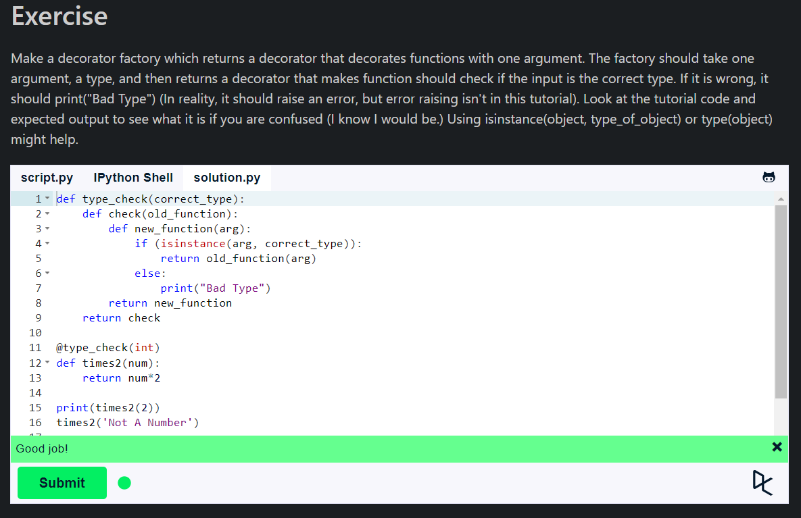
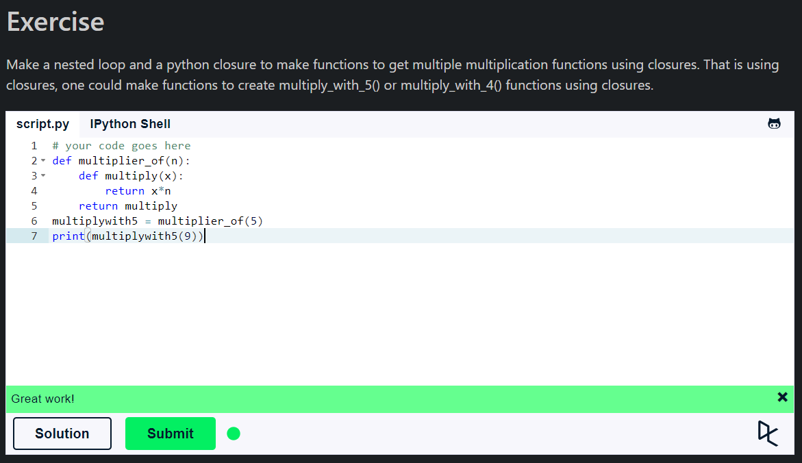

## **Generators**

- Generators are used to create iterators, but with a different approach.
- Generators are simple functions which return an iterable set of items, one at a time.
- When an iteration over a set of items starts using the `for` statement, the generator is run. Once the generator's function code reaches a `yield` statement, the generator yields its execution back to the `for` loop, returning a new value from the set. The generator function can generate as many values (possibly infinite) as it wants, yielding each one in its turn.
- Generators are memory friendly, because they don't store all the values in memory, they generate the values on the fly.
- The `yield` statement is used to define a generator, replacing the `return` of a function to provide a result to its caller without destroying local variables.
- Easy to implement, but a bit difficult to understand.

```python
def countdown(num):
    print('Starting')
    while num > 0:
        yield num
        num -= 1
```



## **Decorators**

- Decorators allow us to make simple modifications to callable objects like functions, methods, or classes.
- Decorators are very powerful and useful tool in Python since it allows programmers to modify the behavior of function or class.
- Decorators allow us to wrap another function in order to extend the behavior of the wrapped function, without permanently modifying it.
- In Decorators, functions are taken as the argument into another function and then called inside the wrapper function.
- ```@``` is used to specify a decorator to be applied on another function.
- ``**kwds`` is used to pass a variable number of arguments to a function.

    ```python
    def my_decorator(func):
        def wrapper():
            print('Something is happening before the function is called.')
            func()
            print('Something is happening after the function is called.')
        return wrapper
    ```

    ```python
    def repeater(old_fun):
        def new_fun(*args, **kwds):
        old_fun(*args, **kwds)
        old_fun(*args, **kwds)
        return new_fun
    ```



## **Closures**

- A closure is a function object that remembers values in enclosing scopes even if they are not present in memory.
- It is a record that stores a function together with an environment: a mapping associating each free variable of the function (variables that are used locally, but defined in an enclosing scope) with the value or reference to which the name was bound when the closure was created.
- A `Nested Function` is a function defined inside another function. It's very important to note that the nested functions can access the variables of the enclosing scope.
- The `nonlocal` keyword is used to work with variables inside nested functions, where the variable should not belong to the inner function.

```python
def outer_function(text):
    text = text
    def inner_function():
        print(text)
    return inner_function
```

- **Advantages of using closures:**
  - **Data Hiding:** This is an important feature of using closures in Python. This is how the data encapsulation is achieved using closures.
  - **Function Factories:** Closures are used to create functions dynamically.
  - **Callback Functions:** Closures can also be used to implement callback functions.



## **Summary**

- Generators are used to create iterators, but with a different approach.
- Decorators allow us to make simple modifications to callable objects like functions, methods, or classes.
- Closures are used to create data hiding and encapsulation.
- Closures can also be used to create function factories and callback functions.
