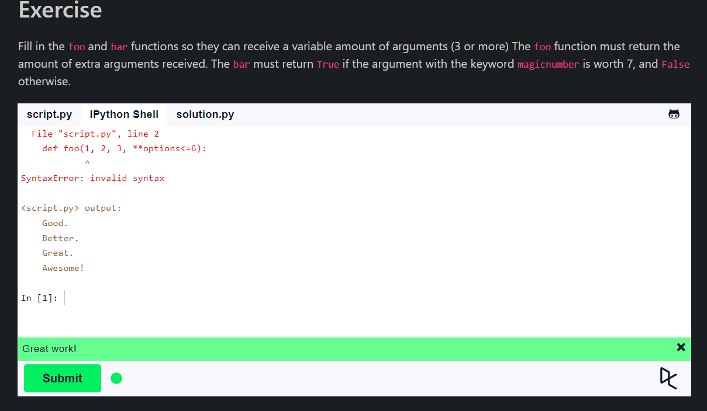
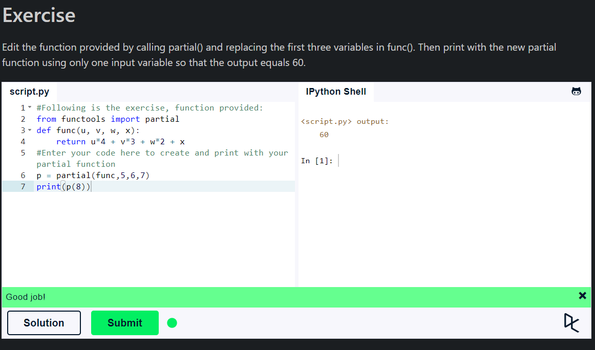

## **Multiple Function Arguments**

- Python allows us to have multiple function arguments.
- We can pass a variable number of arguments to a function using special symbols.
- There are two special symbols:
  - `*args` (Non-Keyword Arguments)
  - `**kwargs` (Keyword Arguments)
- `*args` allows us to pass a variable number of non-keyword arguments to the function.
- `**kwargs` allows us to pass a variable number of keyword arguments to the function.
- `**` is used to pass a keyworded, variable-length argument list.

## **Partial Functions**

- Partial functions allow us to fix a certain number of arguments of a function and generate a new function.
- The `functools` module provides us with the `partial` function which can be used to create a new function with some partial arguments.
- The `partial` function is used for partial function application which "freezes" some portion of a function's arguments and/or keywords resulting in a new object with a simplified signature.

## **Global Variable**

- A variable declared outside of the function or in global scope is known as a global variable.
- This means that a global variable can be accessed inside or outside of the function.
- If you want to read the value of a global variable from a function, you can do it by simply stating the variable name.
- If you want to modify the value of a global variable from a function, you can do it by declaring the variable as `global` inside the function.

## **Local Variable**

- A variable declared inside the function's body or in the local scope is known as a local variable.
- A local variable can only be accessed inside the function in which it is declared.

## **Summary**

- Multiple Function Arguments allow us to pass a variable number of arguments to a function.
- Partial Functions allow us to fix a certain number of arguments of a function and generate a new function.
- Global and Local Variables are used to access and modify the values of variables from inside or outside of the function.
