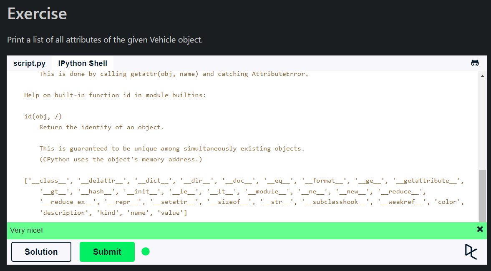
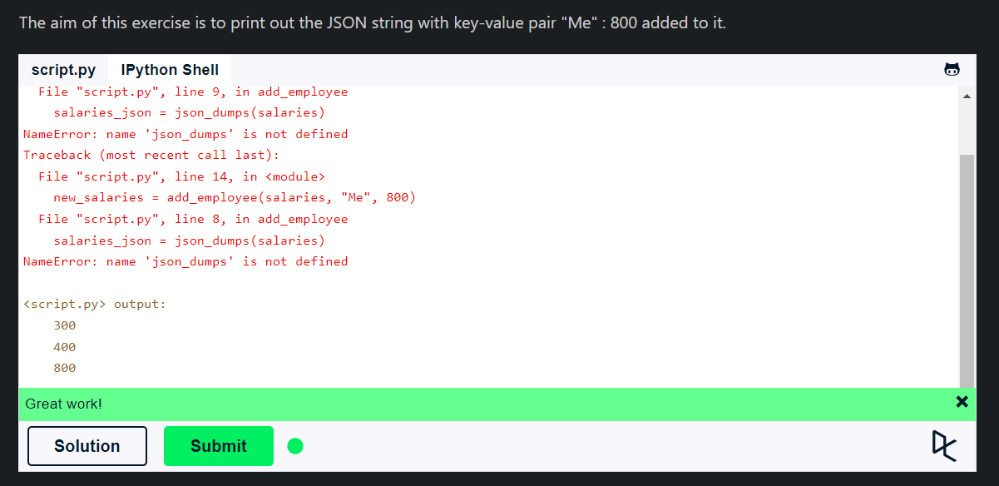

## **Code Introspection**

- **Code introspection** is the ability to examine classes, functions, and keywords to know what they are, what they do, and what they know.
- Python provides several functions and modules for this purpose.
- The `help()` function is used to display the documentation of modules, functions, classes, and methods.
- The `dir()` function is used to list the attributes and methods of a module, class, or object.
- The `type()` function is used to get the type of an object.
- The `inspect` module provides functions for examining classes, functions, and modules in more detail.
- The `__doc__` attribute is used to access the docstring of a module, function, class, or method.
- The `__name__` attribute is used to access the name of a module, function, class, or method.
- The `__module__` attribute is used to access the module in which a class or function was defined.
- The `__dict__` attribute is used to access the dictionary containing the namespace of a class or object.
- The `__bases__` attribute is used to access the base classes of a class.
- The `inspect.getsource()` function is used to get the source code of a Python object.
- The `inspect.getfile()` function is used to get the file in which a Python object was defined.
- The `inspect.getmodule()` function is used to get the module in which a Python object was defined.
- The `id()` function is used to get the memory address of an object.
- The `issubclass()` function is used to check if a class is a subclass of another class.
- The `isinstance()` function is used to check if an object is an instance of a class.

## **Serialization**

- **Serialization** is the process of converting an object into a format that can be stored or transmitted.
- It has the following uses:
  - **Data Persistence**: Saving an object to a file or database.
  - **Data Transfer**: Sending an object over a network.
  - **Interprocess Communication**: Passing an object between processes.
- It has `two` types:
  - **Pickle**: It is used for serializing and de-serializing a Python object structure.
  - **JSON**: It is used for serializing and de-serializing a Python object structure.
- The `pickle` module is used for serializing and de-serializing Python objects.
- The `json` module is used for serializing and de-serializing Python objects in JSON format.
- The `dump()` function is used to serialize an object to a file.
- The `load()` function is used to de-serialize an object from a file.
- The `dumps()` function is used to serialize an object to a string.
- The `loads()` function is used to de-serialize an object from a string.

## **Summary**

- **Code introspection** is the ability to examine classes, functions, and keywords to know what they are, what they do, and what they know.
- The `help()`, `dir()`, `type()`, and `inspect` module are used for code introspection.
- **Serialization** is the process of converting an object into a format that can be stored or transmitted.
- It has `two` types: `Pickle` and `JSON`.
- The `pickle` module is used for serializing and de-serializing Python objects.
- The `json` module is used for serializing and de-serializing Python objects in JSON format.
- The `dump()`, `load()`, `dumps()`, and `loads()` functions are used for serialization and de-serialization.