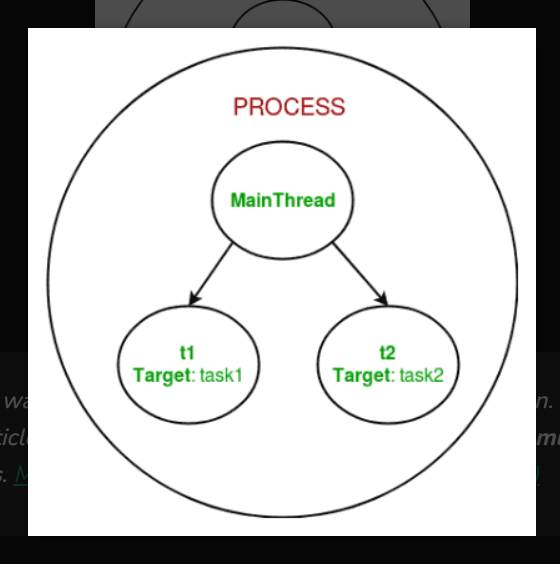

## **Asynchronous Programming (asyncio)**

- **Asynchronous Programming** is a programming paradigm that allows the CPU to perform other tasks while waiting for I/O operations to complete.
- **asyncio** is a library in Python that provides support for writing asynchronous code using the async/await syntax.
- **asyncio** is used to write concurrent code that is more efficient than traditional synchronous code.
- **asyncio** is used to write code that is non-blocking and can handle multiple I/O operations concurrently.
- It is used to write code that is more responsive and can handle I/O-bound tasks efficiently.
- It's actually a order of execution of code in a program. This means that the program can execute multiple tasks concurrently without blocking the main thread.
- It's type:
  - **Asynchronous I/O**: It is a form of input/output processing that permits other processing to continue before the transmission has finished.

  - **Asynchronous Programming**: It is a form of parallel programming that allows a unit of work to run separately from the main application thread.

- **asyncio.gather** is used to run multiple tasks concurrently and wait for all of them to complete.
- **asyncio.wait** is used to run multiple tasks concurrently and wait for any of them to complete.

## **Multithreading**

- Threads are lightweight processes that share the same memory space and can run concurrently.
- **Multithreading** is a programming technique that allows a single process to execute multiple tasks concurrently.
- **Multithreading** is used to write code that is more responsive and can handle multiple tasks concurrently.
- It is used to write code that is more efficient than traditional synchronous code.
- **Multithreading** is used to write code that is non-blocking and can handle multiple I/O operations concurrently.
- It **threading.Thread(target, args)**, where target is the function to be executed in the thread and args is the arguments to be passed to the function.
- **threading.Thread.start()** is used to start the thread.
- **threading.Thread.join()** is used to wait for the thread to complete.
- **threading.Thread.is_alive()** is used to check if the thread is still running.
- **threading.Thread.daemon** is used to set the thread as a daemon thread.
- **os.getpid()** is used to get the process ID of the current process.

    

- ThreadPool is a pool of threads that can be used to execute multiple tasks concurrently.
- ThreadPoolExecutor is a class in the concurrent.futures module that provides a high-level interface for creating and managing a pool of threads.
- **ThreadPoolExecutor.submit()** is used to submit a task to the thread pool.
- **ThreadPoolExecutor.shutdown()** is used to shut down the thread pool.
- **ThreadPoolExecutor.map()** is used to map a function to a list of arguments and execute it in the thread pool.
- **max_workers** is the maximum number of threads that can be used by the thread pool.

## **Summary**

- **Asynchronous Programming** is a programming paradigm that allows the CPU to perform other tasks while waiting for I/O operations to complete.
- **asyncio** is a library in Python that provides support for writing asynchronous code using the async/await syntax.
- **Multithreading** is a programming technique that allows a single process to execute multiple tasks concurrently.
- **ThreadPoolExecutor** is a class in the concurrent.futures module that provides a high-level interface for creating and managing a pool of threads.
- **ThreadPoolExecutor.submit()** is used to submit a task to the thread pool.
- **ThreadPoolExecutor.shutdown()** is used to shut down the thread pool.
- **ThreadPoolExecutor.map()** is used to map a function to a list of arguments and execute it in the thread pool.
- **max_workers** is the maximum number of threads that can be used by the thread pool.
