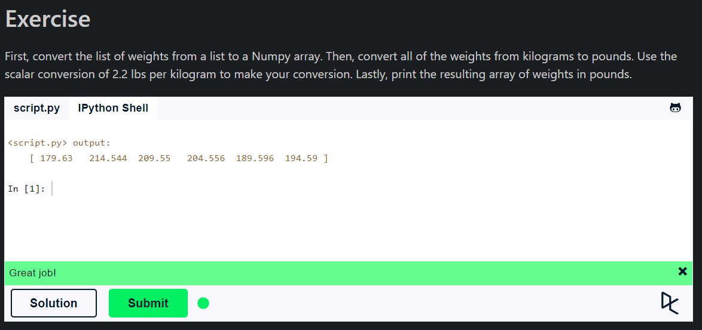

## **Numpy**

- **Numpy** is a library for the Python programming language, adding support for large, multi-dimensional arrays and matrices, along with a large collection of high-level mathematical functions to operate on these arrays.
- NumPy is short for "Numerical Python".

### **Why Numpy?**

- **Memory efficiency**: NumPy's arrays are more compact than Python lists.
- **Convenience**: You can write vectorized code on NumPy arrays, not on lists.

### **What is an "array"**

- An array is a data structure that stores values of same data type. In Python, this is the main difference between arrays and lists. While python lists can contain values corresponding to different data types, arrays in python can only contain values corresponding to same data type.

- **Subsetting** are the array is a simple task. Given an array of integers, you have to return the array of integers after removing the duplicates.

- **ndim** used for the number of dimensions of the array.
- **Indexing** is used to get the elements from the array.
- **Slice** is used to get a range of elements from the array.
  - **Note: The result includes the start index, but excludes the end index**

## **Summary**

- **Numpy** is a library for the Python programming language, adding support for large, multi-dimensional arrays and matrices and includes numerical functions.
- **Indexing**: Used to get the elements from the array.
- **Slice**: Used to get a range of elements from the array.
  - **Note: The result includes the start index, but excludes the end index**
