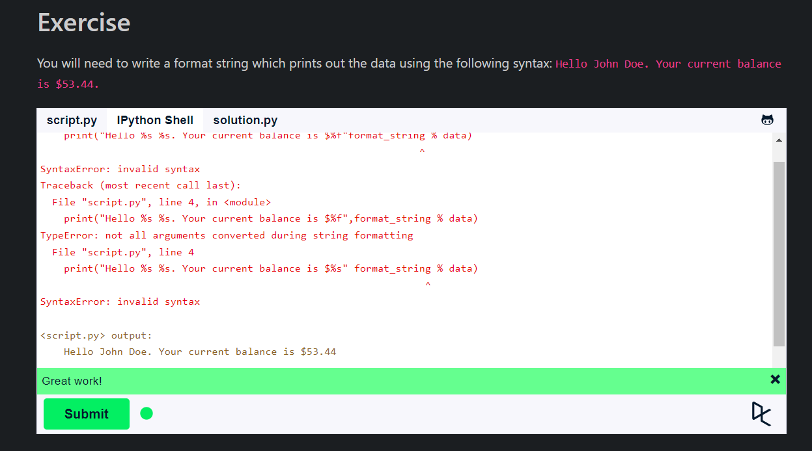
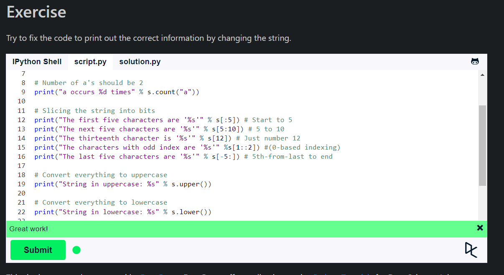
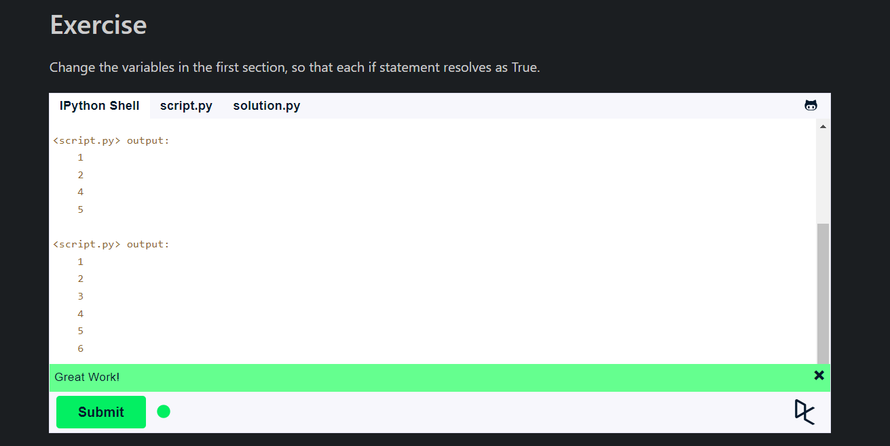
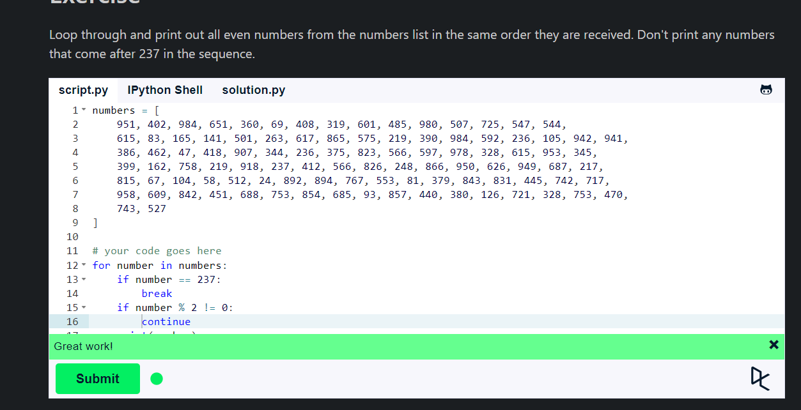
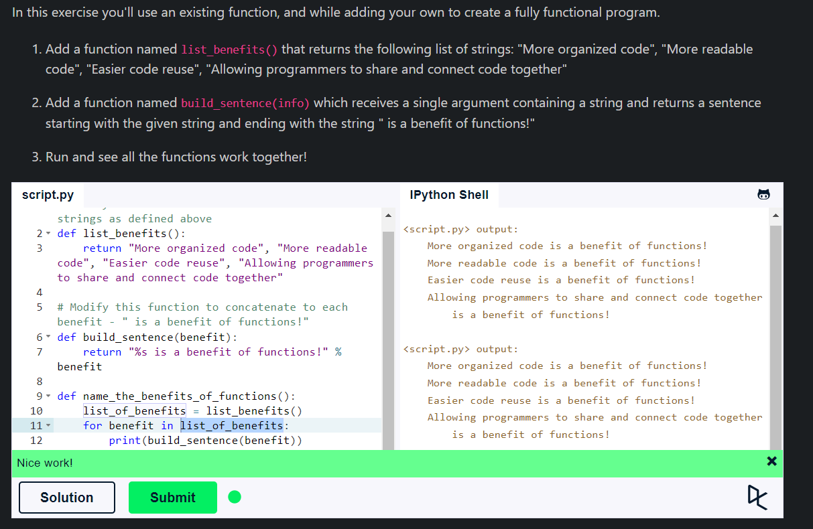

## **String Formatting**

- Python uses C-style string formatting to create new, formatted strings.
- The "%" operator is used to format a set of variables enclosed in a "tuple" (a fixed size list), together with a format string, which contains normal text together with "argument specifiers", special symbols like "%s" and "%d".

- %s - String (or any object with a string representation, like numbers)
- %d - Integers
- %f - Floating point numbers
- %.\<number of digits\>f - Floating point numbers with a fixed amount of digits to the right of the dot.
- %x/%X - Integers in hex representation (lowercase/uppercase)

```python
name = "John"
print("Hello, %s!" % name)
```

- repr() function returns a string containing a printable representation of an object as string.



## **Basic String Operations**

- Strings are bits of text. They can be defined as anything between quotes:
  - Single quotes: 'allows embedded "double" quotes'
  - Double quotes: "allows embedded 'single' quotes".
  - Triple quotes: '''Three single quotes''' or """Three double quotes""".
  - Strings can be concatenated (glued together) with the + operator, and repeated with *:



## **Conditions**

- Python uses boolean variables to evaluate conditions. The boolean values True and False are returned when an expression is compared or evaluated.
  - The "==" operator compares the values of both the operands and checks for value equality. Whereas "is" operator checks whether both the operands refer to the same object or not.
  - The "and" and "or" operators are called logical operators. The "not" operator is called a negation operator.
  - The "in" operator is used to check if a value is present in a sequence or not.
  - The "not in" operator is used to check if a value is not present in a sequence or not.
  - The "is" operator is used to compare the memory location of two objects.
  - The "not" operator is used to negate the truth value.
  - The "elif" keyword is short for "else if", and is useful to avoid excessive indentation.

  

## **Loops**

- Python has two primitive loop commands:
  - while loops
  - for loops
- For loops can iterate over a sequence of numbers using the "range" and "xrange" functions. The difference between range and xrange is that the range function returns a new list with numbers of that specified range, whereas xrange returns an iterator, which is more efficient.
- Range function returns a list of numbers created using range() function. It is used to create a sequence of numbers. It is used in for loop.
- Xrange function returns the generator object that can be used to display numbers only by looping. It is used when a very large range is required. It is used in for loop.
- [start:stop:step] is used to slice a sequence. The start index is included, the stop index is not included, and the step specifies how many elements to move forward after the first element is taken from the sequence.



## **Functions**

- A function is a block of organized, reusable code that is used to perform a single, related action. Functions provide better modularity for your application and a high degree of code reusing.
- As you already know, Python gives you many built-in functions like print(), etc. but you can also create your own functions. These functions are called user-defined functions.
- You can define functions to provide the required functionality. Here are simple rules
  - Function blocks begin with the keyword **def** followed by the function name and parentheses ().
  - Any input parameters or arguments should be placed within these parentheses. You can also define parameters inside these parentheses.
  - The first statement of a function can be an optional statement - the documentation string of the function or docstring.
  - The code block within every function starts with a colon (:) and is indented.
  - The statement return [expression] exits a function, optionally passing back an expression to the caller. A return statement with no arguments is the same as return None.
- A function can return a value. If a function does not return a value, it returns None.
- The return statement is used to exit a function and go back to the place from where it was called.
- The return statement can contain an expression that gets evaluated and the value is returned.
- The return statement can be used to return multiple values from a function.

```python
def function_name(parameters):
    """docstring"""
    statement(s)
    return [expression]
```



## **Summary**

- Python uses C-style string formatting to create new, formatted strings.
- The "%" operator is used to format a set of variables enclosed in a "tuple" (a fixed size list), together with a format string, which contains normal text together with "argument specifiers", special symbols like "%s" and "%d".
- Strings are bits of text. They can be defined as anything between quotes:
  - Single quotes: 'allows embedded "double" quotes'
  - Double quotes: "allows embedded 'single' quotes".
  - Triple quotes: '''Three single quotes''' or """Three double quotes""".
- Python uses boolean variables to evaluate conditions. The boolean values True and False are returned when an expression is compared or evaluated.
- Python has two primitive loop commands:
  - while loops
  - for loops
- A function is a block of organized, reusable code that is used to perform a single, related action. Functions provide better modularity for your application and a high degree of code reusing.
  