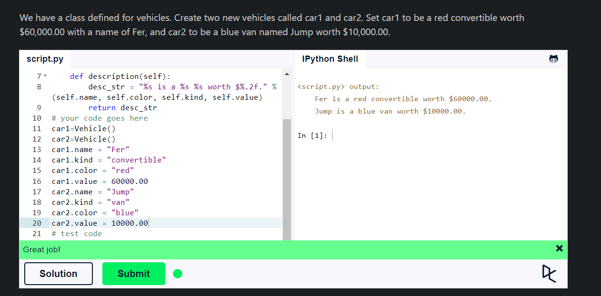
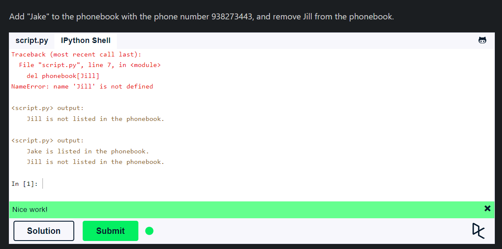
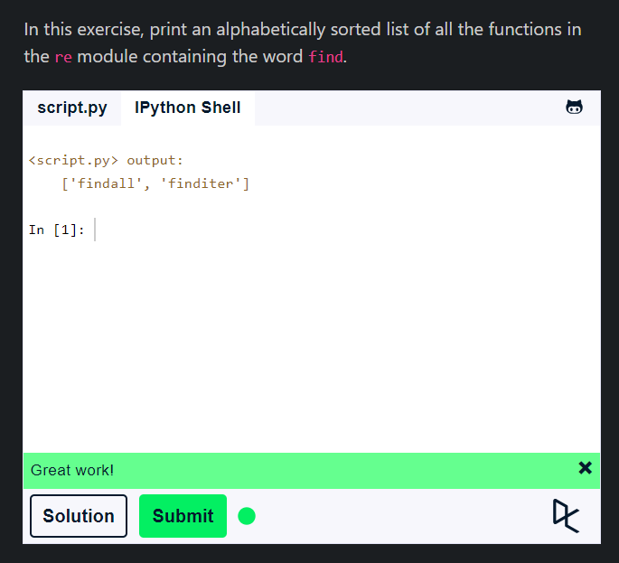

## **Classes & Objects**

- Classes are user-defined data types that act as a blueprint for creating objects.
- Objects are instances of classes. Objects are encapsulation of variables and functions into single entity.
- Classes are defined using the `class` keyword.
- Multiple different objects that are of the same class(have the same variables and functions defined). However, each object contains independent copies of the variables defined in the class.
- The `__init__` method is a special method in Python classes. It is called when an object is created.
- The `self` keyword is used to refer to the object itself.

````python
class Person:
    def __init__(self, name, age):
        self.name = name
        self.age = age

    def say_hello(self):
        print(f"Hello, my name is {self.name} and I am {self.age} years old")
````

- To create an object of a class, we call the class as if it were a function.
- We can access the variables and functions of an object using the `.` operator.



## **Dictionaries**

- A dictionary is a data type similar to arrays, but works with keys and values instead of indexes.
- Dictionaries are a data structure in Python that store key-value pairs.
- Dictionaries are defined using curly braces `{}`.
- The key-value pairs are separated by a colon `:`.
- The keys must be unique and immutable.
- The values can be of any data type.
- All keys must be accessed well iterating over the dictionary.

````python
person = {
    "name": "John",
    "age": 36,
    "country": "Norway"
}

print(person["name"])
print(person["age"])
print(person["country"])
````

- ``del`` keyword is used to delete a key-value pair from a dictionary.
- ```person.keys()``` returns a list of all the keys in the dictionary.
- ```person.values()``` returns a list of all the values in the dictionary.



## **Modules & Packages**

- A module is a file containing Python definitions and statements. The file name is the module name with the suffix `.py` appended.
- A package is a collection of modules.
- Modules can contain functions, classes, and variables.
- Modules are imported using the `import` keyword.
- We can import specific functions or variables from a module using the `from` keyword.
- We can create our own modules by creating a Python file with functions and variables and then importing it into another file.
- We can install packages using the `pip` package manager.

````python
# mymodule.py
def greeting(name):
    print(f"Hello, {name}")
````

````python
# main.py
import mymodule
````
````python
# main.py
from mymodule import greeting
````

````python
# main.py
import camelcase
c = camelcase.CamelCase()
txt = "hello world"
print(c.hump(txt))
````

````python
# main.py
!pip install camelcase
````

- dir() function returns all properties and methods of the specified object, without the values.



## **Summary**

- Classes are user-defined data types that act as a blueprint for creating objects.
- Objects are instances of classes. Objects are encapsulation of variables and functions into single entity.
- Dictionaries are a data structure in Python that store key-value pairs.
- Modules are imported using the `import` keyword.
- We can import specific functions or variables from a module using the `from` keyword.
- We can create our own modules by creating a Python file with functions and variables and then importing it into another file.
- We can install packages using the `pip` package manager.
