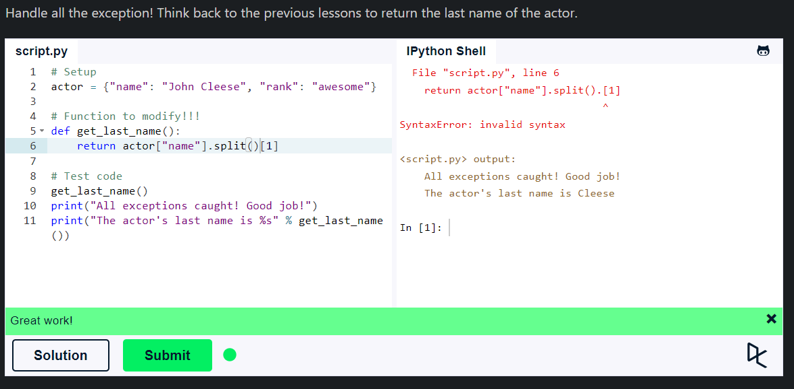

## **File handling**

File handling is an important part of any web application. Python has several functions for creating, reading, updating, and deleting files.

- The key function to work with files in Python is the `open()` function.
- The `open()` function takes two parameters: filename and mode.
- There are four different methods (modes) for opening a file:
  - "r" - Read - Default value. Opens a file for reading, error if the file does not exist
  - "a" - Append - Opens a file for appending, creates the file if it does not exist
  - "w" - Write - Opens a file for writing, creates the file if it does not exist
  - "x" - Create - Creates the specified file, returns an error if the file exists
- In addition, you can specify if the file should be handled as binary or text mode
  - "t" - Text - Default value. Text mode
  - "b" - Binary - Binary mode (e.g. images)
- To open a file, use the built-in `open()` function with one of the following operations:
- Append means opening the file in append mode. If the file does not exist, it creates a new file for writing.

  - `f = open("demofile.txt")` - opens the file in read mode
  - `f = open("demofile.txt", "rt")` - opens the file in read mode
  - `f = open("demofile.txt", "r")` - opens the file in read mode
  - `f = open("demofile.txt", "w")` - opens the file in write mode
  - `f = open("demofile.txt", "a")` - opens the file in append mode
  - `f = open("demofile.txt", "x")` - creates the specified file, returns an error if the file exists
- To close a file, use the `close()` method:

  - `f.close()`

- with statement is used to open a file, do operations on it, and automatically close it.

  - ```python
        with open("demofile.txt") as f:
            print(f.read())
      ```

- __ name__ == '__ main__' is used to check whether the script is being run directly or being imported.

    ```python
        if __name__ == '__main__':
            print("Hello, World!")
    ```

### **Exception handling**
  
  When an error occurs, or exception as we call it, Python will normally stop and generate an error message. These exceptions can be handled using the try statement.
- The `try` block lets you test a block of code for errors.
- The `except` block lets you handle the error.
- The `finally` block lets you execute code, regardless of the result of the try- and except blocks.

  ```python
        try:
            print(x)
        except:
            print("An exception occurred")
        finally:
            print("The 'try except' is finished")
  ```

- You can use the `else` keyword to define a block of code to be executed if no errors were raised:
  
    ```python
          try:
              print("Hello")
          except:
              print("Something went wrong")
          else:
              print("Nothing went wrong")
    ```

- The `raise` keyword is used to raise an exception.

    ```python
        x = -1

        if x < 0:
            raise Exception("Sorry, no numbers below zero")
    ```

- You can define what kind of error to raise, and the text to print to the user.

    ```python
        x = "hello"

        if not type(x) is int:
            raise TypeError("Only integers are allowed")
    ```



## **Summary**

- File handling is an important part of any web application.
- Python has several functions for creating, reading, updating, and deleting files.
- The key function to work with files in Python is the `open()` function.
- The `open()` function takes two parameters: filename and mode.
- There are four different methods (modes) for opening a file.
- In addition, you can specify if the file should be handled as binary or text mode.
- To open a file, use the built-in `open()` function with one of the following operations.
- To close a file, use the `close()` method.
- with statement is used to open a file, do operations on it, and automatically close it.
- `__name__ == '__main__'` is used to check whether the script is being run directly or being imported.
- When an error occurs, or exception as we call it, Python will normally stop and generate an error message.
- These exceptions can be handled using the try statement.
- The `try` block lets you test a block of code for errors.
- The `except` block lets you handle the error.
- The `finally` block lets you execute code, regardless of the result of the try- and except blocks.
- You can use the `else` keyword to define a block of code to be executed if no errors were raised.
- The `raise` keyword is used to raise an exception.
- You can define what kind of error to raise, and the text to print to the user.
