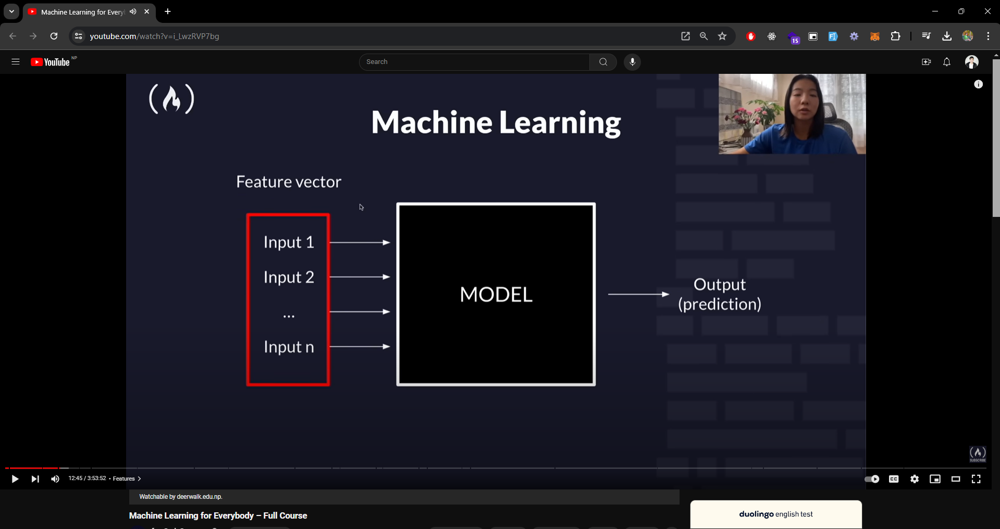
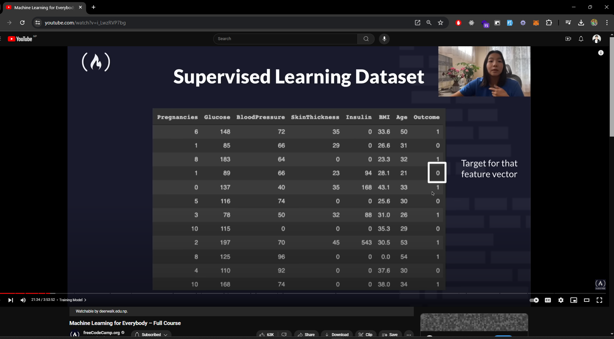

# **Machine Learning for Everybody – Full Course**

Welcome to the **Machine Learning for Everybody – Full Course** by **freeCodeCamp.org**. This course covers the essentials of machine learning, including supervised and unsupervised learning, regression, classification, clustering, and more. The course includes hands-on coding examples using Python and the scikit-learn library.

## **Course Overview**

### **Introduction to Machine Learning**

- **Artificial Intelligence** vs **Machine Learning** vs **Data Science**
- Machine learning is a subset of AI focused on solving specific problems and making predictions using given data.

### **Supervised Learning**

- **Supervised Learning** vs **Unsupervised Learning**
- Supervised learning involves training a model on labeled data, while unsupervised learning involves training a model on unlabeled data.
- Reinforcement learning is another type of machine learning that involves training a model to make sequences of decisions.

### **Features**

- **Feature Qualitative**: A feature is a measurable property or characteristic of a phenomenon being observed.
- ONE HOT ENCODING: One hot encoding is a technique used to convert categorical data into numerical data.
- Type of Data:

  - **Numerical Data**: Numerical data consists of numbers.
  - **Categorical Data**: Categorical data consists of categories or labels.
  - **Ordinal Data**: Ordinal data consists of categories with a specific order.
  - **Quantitative Data**: Quantitative data consists of numerical data that can be measured.

### **Classification**

- **Classification**: Classification is a type of supervised learning that involves predicting categories or labels and predict discrete values. There are two main types of classification:
`Binary Classification`: Binary classification involves predicting one of two categories.
`Multi-Class Classification`: Multi-class classification involves predicting one of multiple categories.

### **Regression**

- **Regression**: Regression is a type of supervised learning that involves predicting continuous values.

## **Training Models**

### **Training and Testing Data**

- **Training Data**: Training data is used to train a machine learning model.
- **Testing Data**: Testing data is used to evaluate the performance of a machine learning model.
- **Validation Data**: Validation data is used to fine-tune a machine learning model.

### **Loss**

- **Loss Function**: A loss function is used to measure the error between the predicted values and the actual values.

### **Metrics of Performance**

- **Metrics of Performance**: Metrics of performance are used to evaluate the performance of a machine learning model.

### **Accuracy**

- **Accuracy**: Accuracy is the ratio of correct predictions to total predictions.

## **Project-I: MAGIC Gamma Telescope**

This project involves using data from the MAGIC Gamma Telescope to classify gamma (signal) and hadron (background) events.

### **Data Source**

The data for this project can be downloaded from the UCI Machine Learning Repository: [MAGIC Gamma Telescope Data](https://archive.ics.uci.edu/ml/datasets/MAGIC+Gamma+Telescope)

The data file is named `magic04.data`.

### **Data Description**

The dataset contains the following columns:

1. **fLength**: continuous
2. **fWidth**: continuous
3. **fSize**: continuous
4. **fConc**: continuous
5. **fConc1**: continuous
6. **fAsym**: continuous
7. **fM3Long**: continuous
8. **fM3Trans**: continuous
9. **fAlpha**: continuous
10. **fDist**: continuous
11. **class**: g (gamma, signal), h (hadron, background)
