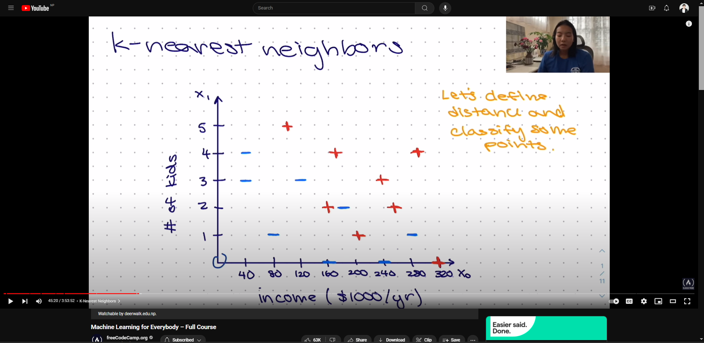

## **Project-I: MAGIC Gamma Telescope**

This project involves using data from the MAGIC Gamma Telescope to classify gamma (signal) and hadron (background) events.

### **Data Source**

The data for this project can be downloaded from the UCI Machine Learning Repository: [MAGIC Gamma Telescope Data](https://archive.ics.uci.edu/ml/datasets/MAGIC+Gamma+Telescope)

The data file is named `magic04.data`.

### **Data Description**

The dataset contains the following columns:

1. **fLength**: continuous
2. **fWidth**: continuous
3. **fSize**: continuous
4. **fConc**: continuous
5. **fConc1**: continuous
6. **fAsym**: continuous
7. **fM3Long**: continuous
8. **fM3Trans**: continuous
9. **fAlpha**: continuous
10. **fDist**: continuous
11. **class**: g (gamma, signal), h (hadron, background)

## **Model Classification**

# K-nearest Neighbors (KNN)

K-nearest neighbors (KNN) is a type of supervised learning algorithm used for classification. It classifies data points based on their similarity to other data points.

## Key Concepts

- **K**: K is the number of neighbors to consider when classifying a data point.
- **Distance Metric**: The distance metric is used to measure the similarity between data points.
- **Majority Class**: The majority class is the class that occurs most frequently among the K-nearest neighbors.
- **Euclidean Distance**: Euclidean distance is a common distance metric used in K-nearest neighbors.

# Naive Bayes

Naive Bayes is a type of supervised learning algorithm based on Bayes' theorem. It is used for classification and is known for its simplicity and efficiency.

## Key Concepts

- **Bayes' Theorem**: Bayes' theorem is a mathematical formula that describes the probability of an event based on prior knowledge of conditions that might be related to the event.
- **Conditional Independence**: Naive Bayes assumes that the features are conditionally independent given the class label.
- **Likelihood**: The likelihood is the probability of observing the data given the class label.
- **Prior Probability**: The prior probability is the probability of a class occurring before observing the data.
- **Posterior Probability**: The posterior probability is the probability of a class occurring after observing the data.
- **Evidence**: The evidence is the probability of observing the data.

# Logistic Regression

Logistic regression is a type of supervised learning algorithm used for classification. It is based on the logistic function, which is used to model the probability of a binary outcome.

## Key Concepts

- **Logistic Function / Sigmoid Function**: The logistic function is a sigmoid function that maps input values to probabilities between 0 and 1.
- **Log Odds**: The log odds is the natural logarithm of the odds of the event occurring.
- **Odds Ratio**: The odds ratio is the ratio of the odds of the event occurring to the odds of the event not occurring.
- **Maximum Likelihood Estimation**: Maximum likelihood estimation is a method used to estimate the parameters of a statistical model by maximizing the likelihood function.
- **Cost Function**: The cost function is used to measure the error between the predicted values and the actual values.
