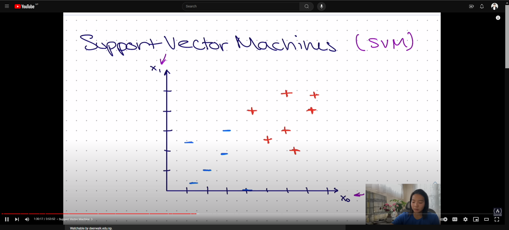
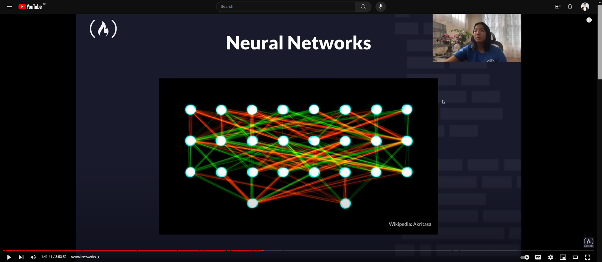

## **Project-I: MAGIC Gamma Telescope**

This project involves using data from the MAGIC Gamma Telescope to classify gamma (signal) and hadron (background) events.

### **Data Source**

The data for this project can be downloaded from the UCI Machine Learning Repository: [MAGIC Gamma Telescope Data](https://archive.ics.uci.edu/ml/datasets/MAGIC+Gamma+Telescope)

The data file is named `magic04.data`.

### **Data Description**

The dataset contains the following columns:

1. **fLength**: continuous
2. **fWidth**: continuous
3. **fSize**: continuous
4. **fConc**: continuous
5. **fConc1**: continuous
6. **fAsym**: continuous
7. **fM3Long**: continuous
8. **fM3Trans**: continuous
9. **fAlpha**: continuous
10. **fDist**: continuous
11. **class**: g (gamma, signal), h (hadron, background)

## **Model Classification**

# K-nearest Neighbors (KNN)

K-nearest neighbors (KNN) is a type of supervised learning algorithm used for classification. It classifies data points based on their similarity to other data points.

## Key Concepts

- **K**: K is the number of neighbors to consider when classifying a data point.
- **Distance Metric**: The distance metric is used to measure the similarity between data points.
- **Majority Class**: The majority class is the class that occurs most frequently among the K-nearest neighbors.
- **Euclidean Distance**: Euclidean distance is a common distance metric used in K-nearest neighbors.

# Naive Bayes

Naive Bayes is a type of supervised learning algorithm based on Bayes' theorem. It is used for classification and is known for its simplicity and efficiency.

## Key Concepts

- **Bayes' Theorem**: Bayes' theorem is a mathematical formula that describes the probability of an event based on prior knowledge of conditions that might be related to the event.
- **Conditional Independence**: Naive Bayes assumes that the features are conditionally independent given the class label.
- **Likelihood**: The likelihood is the probability of observing the data given the class label.
- **Prior Probability**: The prior probability is the probability of a class occurring before observing the data.
- **Posterior Probability**: The posterior probability is the probability of a class occurring after observing the data.
- **Evidence**: The evidence is the probability of observing the data.

# Logistic Regression

Logistic regression is a type of supervised learning algorithm used for classification. It is based on the logistic function, which is used to model the probability of a binary outcome.

## Key Concepts

- **Logistic Function / Sigmoid Function**: The logistic function is a sigmoid function that maps input values to probabilities between 0 and 1.
- **Log Odds**: The log odds is the natural logarithm of the odds of the event occurring.
- **Odds Ratio**: The odds ratio is the ratio of the odds of the event occurring to the odds of the event not occurring.
- **Maximum Likelihood Estimation**: Maximum likelihood estimation is a method used to estimate the parameters of a statistical model by maximizing the likelihood function.
- **Cost Function**: The cost function is used to measure the error between the predicted values and the actual values.

# Support Vector Machine (SVM)

Support Vector Machine (SVM) is a type of supervised learning algorithm used for classification. It finds the hyperplane that best separates the data points into different classes.

## Key Concepts

- **Hyperplane**: A hyperplane is a subspace of one dimension less than the ambient space that divides the space into two half-spaces.
- **Support Vectors**: Support vectors are the data points that lie closest to the hyperplane.
- **Margin**: The margin is the distance between the hyperplane and the support vectors
- **Kernel**: A kernel is a function that maps the input data into a higher-dimensional space to make it linearly separable.

# Neural Network

A neural network is a type of machine learning model that is inspired by the structure and function of the human brain. It consists of layers of interconnected nodes (neurons) that process input data and produce output data.

## Key Concepts

- **Input Layer**: The input layer receives the input data and passes it to the hidden layers.
- **Hidden Layers**: The hidden layers process the input data using weights and activation functions.
- **Output Layer**: The output layer produces the final output of the neural network.
- **Weights**: Weights are the parameters that the neural network learns during training.
- **Activation Functions**: Activation functions introduce non-linearity into the neural network.
- **Backpropagation**: Backpropagation is an algorithm used to update the weights of the neural network based on the error between the predicted values and the actual values.

# **TansorFlow**

TensorFlow is an open-source machine learning library developed by Google. It provides a flexible and efficient way to build and train machine learning models.

## Key Concepts

- **Tensors**: Tensors are multi-dimensional arrays that represent the data used in machine learning models.
- **Graph**: TensorFlow uses a computational graph to represent the operations in a machine learning model.
- **Session**: A session is used to execute the operations in the computational graph.
- **Variables**: Variables are used to store the parameters of the machine learning model.
- **Placeholders**: Placeholders are used to feed input data into the computational graph.
- **Optimizers**: Optimizers are used to update the parameters of the machine learning model during training.
