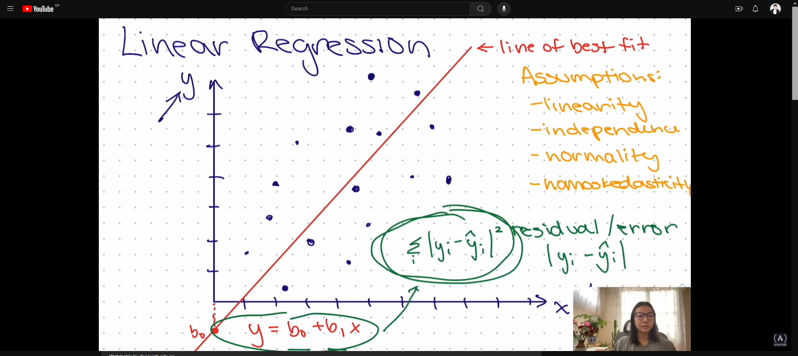
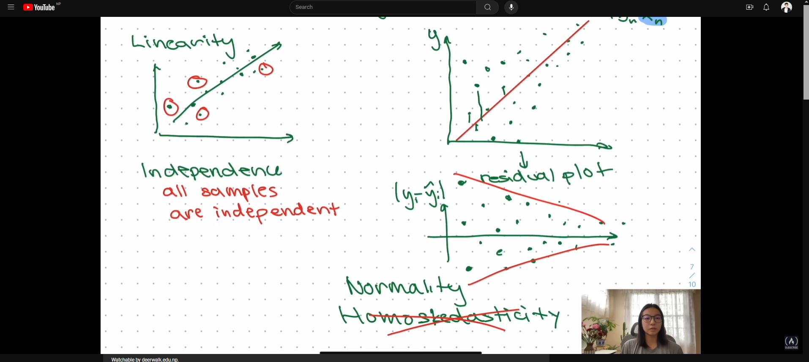

## **Project-II: Seoul Bike Sharing Demand**

This project involves using data from the Seoul Bike Sharing Demand dataset to predict the demand for bike sharing in Seoul.

### **Data Source**

The data for this project can be downloaded from the UCI Machine Learning Repository: [Seoul Bike Sharing Demand](https://archive.ics.uci.edu/dataset/560/seoul+bike+sharing+demand)

The data file is named `seoulBikeData.data`.

### **Data Description**

The dataset contains the following columns:

1. **Date**: Date of the data
2. **Rented Bike Count**: Number of bikes rented
3. **Hour**: Hour of the day
4. **Temperature**: Temperature in Celsius
5. **Humidity**: Humidity percentage
6. **Wind Speed**: Wind speed
7. **Visibility**: Visibility in meters
8. **Dew Point Temperature**: Dew point temperature in Celsius
9. **Solar Radiation**: Solar radiation in MJ/m2
10. **Rainfall**: Rainfall in mm
11. **Snowfall**: Snowfall in cm
12. **Seasons**: Season (Spring, Summer, Autumn, Winter)
13. **Holiday**: Holiday or not (Yes, No)
14. **Functioning Day**: Functioning day or not (Yes, No)

# **Linear Regression**

Linear regression is a type of supervised learning algorithm used for regression. It models the relationship between a dependent variable and one or more independent variables.

## Key Concepts

- **Dependent Variable**: The dependent variable is the variable that is being predicted.
- **Independent Variables**: The independent variables are the variables that are used to predict the dependent variable.
- **Regression Line**: The regression line is the line that best fits the data points in a linear regression model.
- **Slope**: The slope is the coefficient that represents the change in the dependent variable for a one-unit change in the independent variable.
- **Intercept**: The intercept is the value of the dependent variable when the independent variable is zero.
- **Residuals / error**: Residuals or Error are the differences between the observed values and the predicted values in a linear regression model.

## Assumption

- **Linearity**: The relationship between the dependent variable and the independent variables is linear.
- **Independence**: The residuals are independent of each other.
- **Homoscedasticity**: The variance of the residuals is constant.
- **Normality**: The residuals are normally distributed.

## Types of Linear Regression

- **Simple Linear Regression**: Simple linear regression models the relationship between one independent variable and the dependent variable. `(y= b0 + b1*x)`
- **Multiple Linear Regression**: Multiple linear regression models the relationship between multiple independent variables and the dependent variable. `(y= b0 + b1*x1 + b2*x2 + ... + bn*xn)`

## Evaluation for Linear Regression

- **Mean Absolute Error (MAE)**: The mean absolute error is the average of the absolute differences between the observed values and the predicted values.
`formula: MAE = 1/n * Σ|yi - ŷi|`
- **Mean Squared Error (MSE)**: The mean squared error is the average of the squared differences between the observed values and the predicted values.
`formula: MSE = 1/n * Σ(yi - ŷi)^2`
- **Root Mean Squared Error (RMSE)**: The root mean squared error is the square root of the mean squared error.
`formula: RMSE = √(1/n * Σ(yi - ŷi)^2)`
- **R-squared (R2) / Coefficient of Determination**: R-squared is a measure of how well the independent variables explain the variance in the dependent variable.
`formula: R2 = 1 - (Σ(yi - ŷi)^2 / Σ(yi - ȳ)^2)` or `R2 = 1 - RSS/TSS` or `R2 = 1 - (MSE/Var(y))`
where `RSS = Σ(yi - ŷi)^2` and `TSS = Σ(yi - ȳ)^2` and `ȳ = 1/n * Σyi` and `Var(y) = 1/n * Σ(yi - ȳ)^2`
