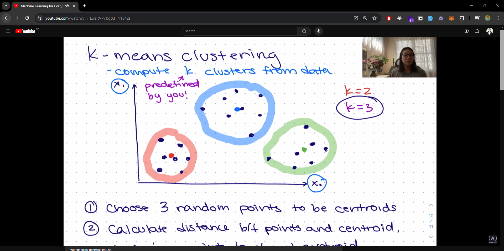
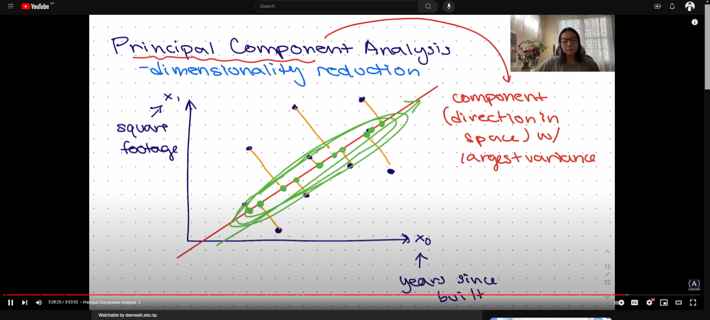
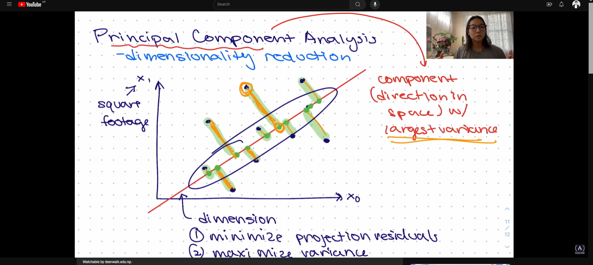

# **K-Mean Clustering**

K-means clustering is a type of unsupervised learning algorithm used for clustering. It partitions the data into K clusters based on the similarity of the data points.

## Key Concepts

- **K**: K is the number of clusters in K-means clustering.
- **Cluster**: A cluster is a group of data points that are similar to each other and dissimilar to data points in other clusters.
- **Centroid**: A centroid is the center of a cluster.
- **Distance Metric**: A distance metric is a function that measures the similarity between data points.
- **Inertia**: Inertia is the sum of squared distances between data points and the centroid of the cluster.
- **Elbow Method**: The elbow method is a technique used to determine the optimal number of clusters in K-means clustering.

## Algorithm

1. Initialize K centroids randomly.
2. Assign each data point to the nearest centroid.
3. Update the centroids by taking the mean of the data points assigned to each centroid.
4. Repeat steps 2 and 3 until convergence.

## Evaluation for K-Means Clustering

- **Inertia**: Inertia is the sum of squared distances between data points and the centroid of the cluster. Lower inertia indicates better clustering.
- **Silhouette Score**: Silhouette score is a measure of how similar an object is to its own cluster compared to other clusters. Higher silhouette score indicates better clustering.

## Expectation-Maximization (EM) Algorithm

K-means clustering is a special case of the Expectation-Maximization (EM) algorithm, where the E-step assigns data points to clusters based on the current centroids, and the M-step updates the centroids based on the assigned data points.

## Applications

- Customer Segmentation
- Image Compression
- Anomaly Detection
- Document Clustering
- Recommendation Systems

## Principal Component Analysis (PCA)

PCA is a dimensionality reduction technique used to reduce the number of features in a dataset while preserving the variance in the data. It is often used in conjunction with K-means clustering to reduce the dimensionality of the data before clustering.

`reduce the dimensionality of the data before clustering and provide more informative clusters.`

