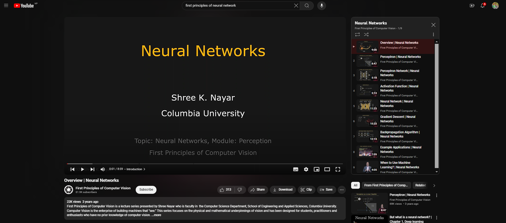

# Overview of Neural Networks and Perceptrons

## Overview of Neural Networks

Neural networks are a set of algorithms, modeled loosely after the human brain, designed to recognize patterns. They interpret sensory data through a kind of machine perception, labeling, or clustering of raw input. The patterns they recognize are numerical and are contained in vectors, into which all real-world data, such as images, sound, text, or time series, must be translated.

### Key Applications

- **Classification**: Assigning labels to data points.
- **Regression**: Predicting continuous values.
- **Generative Tasks**: Creating new data instances (e.g., image synthesis).

## Perceptron

A perceptron is the simplest type of artificial neural network and serves as the fundamental building block of more complex networks. Introduced by Frank Rosenblatt in 1957, a perceptron consists of the following components:

- **Inputs**: Features or data points fed into the perceptron.
- **Weights**: Coefficients that adjust the importance of each input.
- **Bias**: A threshold value added to the weighted sum to adjust the output.
- **Activation Function**: A function that determines the output based on the weighted sum (commonly a step function).

### Functionality

1. Takes multiple binary inputs.
2. Applies weights and sums them up.
3. Passes the sum through an activation function to produce a binary output.
4. The output can be used for decision-making or predictions.

## Perceptron Network

A perceptron network, often referred to as a single-layer perceptron, consists of multiple perceptrons connected in a single layer. Each perceptron in the network receives several inputs, applies weights and biases, and produces an output.

### Characteristics

- **Linearly Separable Problems**: Can solve problems where a hyperplane can separate the classes.
- **Output**: Generates binary outcomes based on the input data.

### Extensions

- **Multi-Layer Perceptron (MLP)**: A more complex structure consisting of multiple layers of perceptrons (neurons) capable of modeling non-linear relationships. These networks are often used in deep learning applications.

