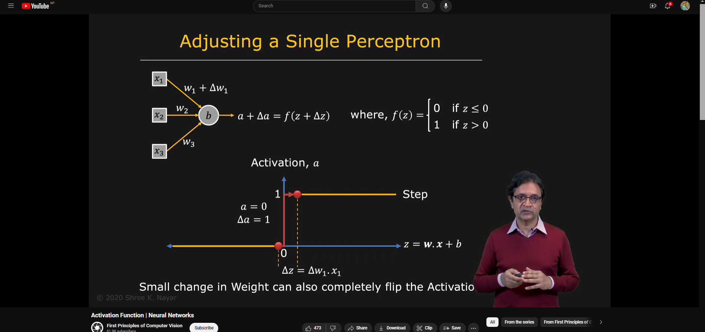

## Activation Functions

Activation functions are mathematical equations that determine the output of a neural network. The function is attached to each neuron in the network, and determines whether it should be activated (“fired”) or not, based on whether each neuron’s input is relevant for the model’s prediction. Activation functions also help normalize the output of each neuron to a range between 1 and 0 or between -1 and 1.

### Types of Activation Functions

1. **Binary Step Function**: The simplest activation function, where the neuron is activated if the input value is above a certain threshold.

2. **Linear Activation Function**: The output is the same as the input. This type of function is mainly used in the output layer of the network.

3. **Sigmoid Activation Function**: Transforms the input into a value between 0 and 1 using the logistic function. It is widely used in the output layer of a binary classification model.

4. **Hyperbolic Tangent (tanh) Activation Function**: Similar to the sigmoid function, but ranges from -1 to 1. It is often used in the hidden layers of a neural network.

5. **Rectified Linear Unit (ReLU) Activation Function**: Sets all negative values in the input to zero, while positive values remain the same. It is widely used in hidden layers of deep neural networks.

6. **Leaky ReLU Activation Function**: An extension of the ReLU function that allows a small gradient when the input is negative, preventing dying ReLU problems.

7. **Softmax Activation Function**: Used in the output layer of a network for multi-class classification tasks. It converts the output into a probability distribution over multiple classes.

## Limitations of Activation Functions

- **Vanishing Gradient Problem**: Some activation functions can cause the gradients to become extremely small, leading to slow or ineffective training of deep neural networks. This is particularly common with the sigmoid and tanh functions.

- **Dying ReLU Problem**: ReLU neurons can sometimes be inactive for any input, causing the neuron to output the same value (zero) for all inputs. This can lead to dead neurons that do not contribute to the learning process.

- **Non-Differentiability**: Some activation functions are not differentiable at certain points, making it challenging to apply gradient-based optimization techniques.

- **Limited Range**: Certain activation functions have a limited output range, which can constrain the learning capacity of the neural network.

- **Complexity**: Choosing the right activation function for a specific task can be challenging, as different functions have different properties and behaviors.

Activation functions play a crucial role in the training and performance of neural networks, and selecting the appropriate function is essential for achieving optimal results in various machine learning tasks. Output layers often use different activation functions than hidden layers, depending on the nature of the problem being solved.

`output = activation_function(weighted_sum + bias)`

