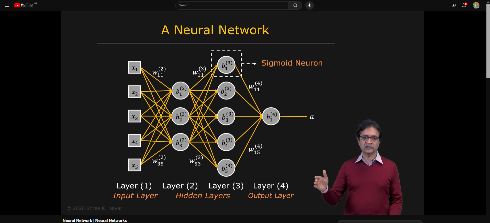
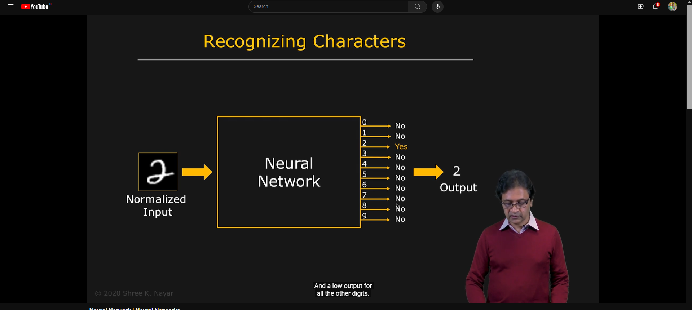
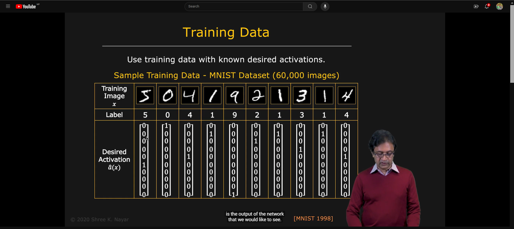
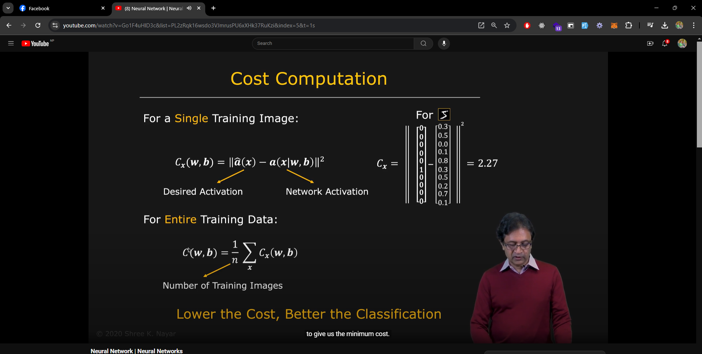
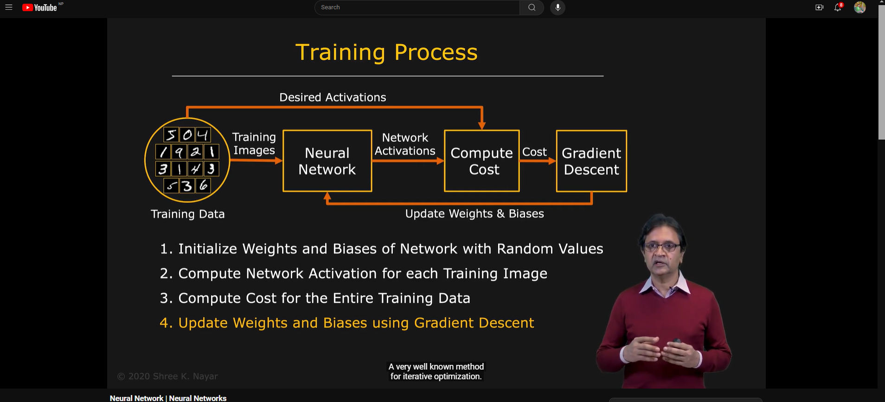

## **Basic Architecture of a Neural Network**

- A neural network is a collection of neurons connected to each other in a specific manner.
- The basic architecture of a neural network consists of three layers:
    1. **Input Layer**
    2. **Hidden Layer**
    3. **Output Layer**
- The input layer receives the input data, the hidden layer processes the input data, and the output layer produces the final output.
- The hidden layer can have multiple layers, and the number of neurons in each layer can vary.
- The connections between neurons are represented by weights, which determine the strength of the connection between neurons.
- The output of each neuron is calculated by applying an activation function to the weighted sum of the inputs.

- The architecture of a neural network can vary depending on the problem being solved and the complexity of the data.

- MNIST dataset is a popular dataset for image classification tasks. It consists of 28x28 pixel grayscale images of handwritten digits (0-9).

## **Desired Activation Output**

- The desired activation output is the expected output of the neural network for a given input.

- For example, in a binary classification problem, the desired activation output for a positive class can be 1, and for a negative class can be 0.

## **Cost Computation**

- The cost function is used to measure how well the neural network is performing.

` Cost = 1/2 * (desired_activation_output - actual_activation_output)^2 `

- The cost function is minimized during the training process to improve the performance of the neural network.

