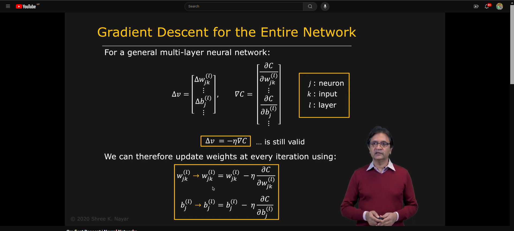

## **Gradient Descent**

- **Gradient Descent** is an optimization algorithm used to minimize some function by iteratively moving in the direction of steepest descent as defined by the negative of the gradient.
- It is used to update the weights of the neural network during the training process to minimize the cost function.

### **Working of Gradient Descent**

- **Step 1: Initialize Weights**
  - The weights of the neural network are initialized with random values.
- **Step 2: Forward Propagation**
  - The input data is passed through the neural network to calculate the output.
- **Step 3: Calculate Error**
  - The error is calculated by comparing the predicted output with the actual output.
- **Step 4: Backward Propagation**
  - The error is propagated back through the network to update the weights.
- **Step 5: Update Weights**
  - The weights are updated using the gradient of the cost function with respect to the weights.
- **Step 6: Repeat**
  - Steps 2 to 5 are repeated until the cost function converges to a minimum.

## **Gradient Computation Complexity**

- The computation of gradients in neural networks can be computationally expensive, especially for deep networks with a large number of parameters.
- The complexity of computing gradients depends on the number of parameters in the network and the size of the training data.

