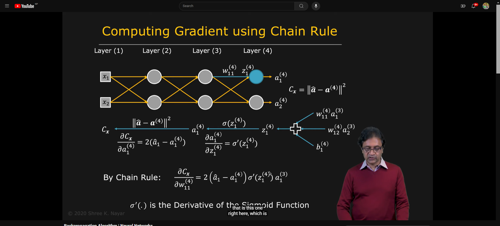
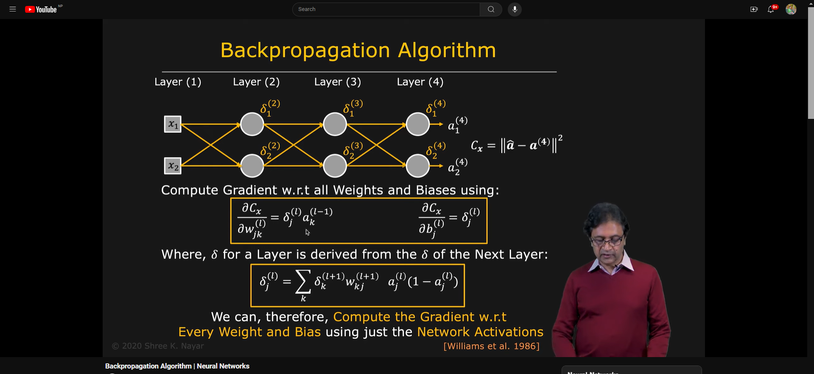
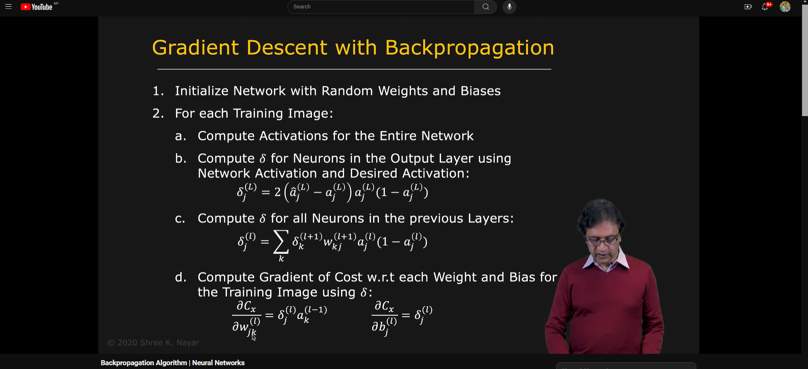
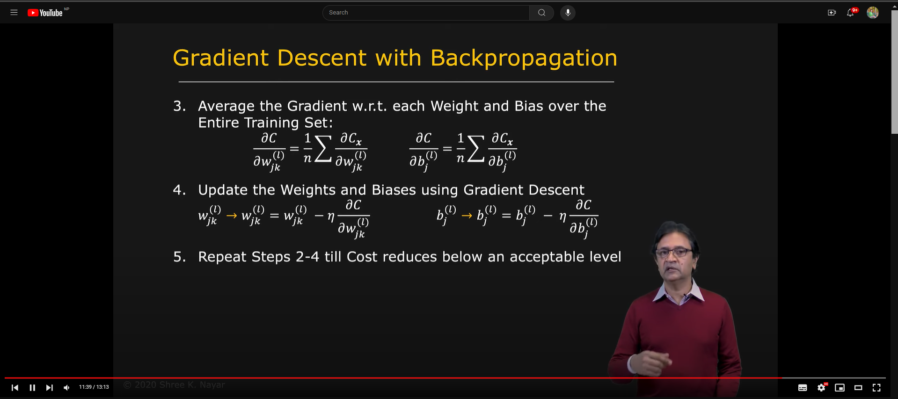
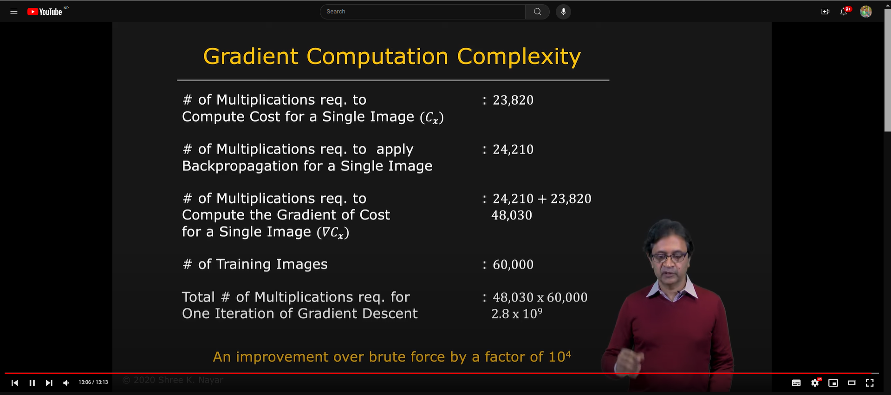

## **Backpropagation Algorithm**

- **Backpropagation** is a supervised learning algorithm used to train neural networks. It works by calculating the gradient of the loss function with respect to the weights of the network, and then updating the weights in the opposite direction of the gradient to minimize the loss.

## **Computing Gradient using Chain Rule**

- **Chain Rule** is a fundamental rule in calculus that allows us to compute the derivative of a composite function.
- In the context of neural networks, the chain rule is used to compute the gradient of the loss function with respect to the weights of the network.

## **Working of Backpropagation Algorithm**

- **Step 1: Forward Propagation**
  - The input data is passed through the neural network to calculate the output.
- **Step 2: Calculate Error**
  - The error is calculated by comparing the predicted output with the actual output.
- **Step 3: Backward Propagation**
  - The error is propagated back through the network to update the weights.
- **Step 4: Update Weights**
  - The weights are updated using the gradient of the cost function with respect to the weights.
- **Step 5: Repeat**
  - Steps 1 to 4 are repeated until the cost function converges to a minimum.

`formula: w = w - α * ∂C/∂w`

## **Backpropagation in Neural Networks**

- **Backpropagation** is a key algorithm for training neural networks.
- It allows us to update the weights of the network in the direction that minimizes the loss function.
- By iteratively updating the weights using backpropagation, the network learns to make better predictions over time.

## **Gradient Descent with Backpropagation**

## **Gradient Computation Complexity**

