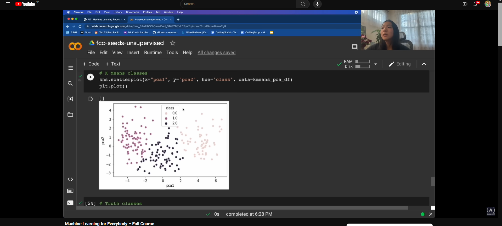

## **Project-III: Unsupervised learning (Seeds)**

This project involves using the Seeds dataset to perform unsupervised learning tasks such as clustering and dimensionality reduction.

### **Data Source**

The data for this project can be downloaded from the UCI Machine Learning Repository: [Seeds Dataset](https://archive.ics.uci.edu/ml/datasets/seeds)

The data file is named `seeds_dataset.txt`.

### **Data Description**

The dataset contains the following columns:

1. **Area**: Area of the seed
2. **Perimeter**: Perimeter of the seed
3. **Compactness**: Compactness of the seed
4. **Length of Kernel**: Length of the seed kernel
5. **Width of Kernel**: Width of the seed kernel
6. **Asymmetry Coefficient**: Asymmetry coefficient of the seed
7. **Length of Kernel Groove**: Length of the seed kernel groove
8. **Class**: Class of the seed (1, 2, 3)

# **Unsupervised Learning**

Unsupervised learning is a type of machine learning algorithm used to draw inferences from datasets consisting of input data without labeled responses. The most common unsupervised learning method is clustering, which is used for exploratory data analysis to find hidden patterns or grouping in data.

## Key Concepts

- **Clustering**: Clustering is the process of grouping similar data points together.
- **Principal Component Analysis (PCA)**: PCA is a technique for reducing the dimensionality of the data by projecting it onto a lower-dimensional subspace.
- **K-means Clustering**: K-means clustering is a method of vector quantization, originally from signal processing, that aims to partition n observations into k clusters in which each observation belongs to the cluster with the nearest mean.m -1 to 1, where a high value indicates that the object is well matched to its own cluster and poorly matched to neighboring clusters.

