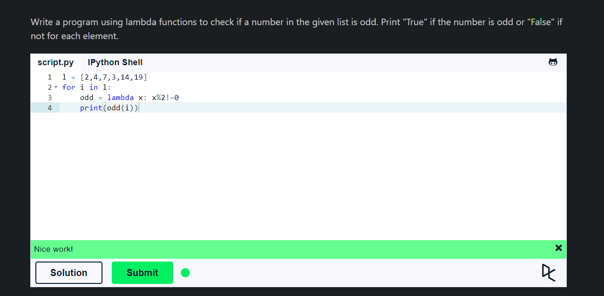
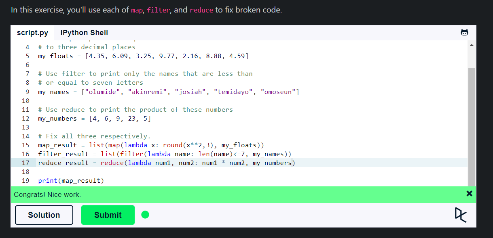

## **Lambda Functions**

- Lambda functions are small, anonymous functions that can have any number of arguments, but can have only one expression.
- They don't need to have a name, so they called anonymous functions. We define a lambda function using the `lambda` keyword.
- Lambda functions can be used wherever function objects are required.
- Lambda functions are syntactically restricted to a single expression.
- It is better shown when you use them as an anonymous function inside another function.



````python
# Lambda Function
add = lambda x, y: x + y
print(add(5, 3))
````

- In the above code, we have defined a lambda function that takes two arguments and returns their sum.

## **Map**

- The `map()` function executes a specified function for each item in an iterable. The item is sent to the function as a parameter.
- The `map()` function returns a map object(which is an iterator) of the results after applying the given function to each item of a given iterable(list, tuple, etc.).

````python
    map(function, iterable)
````

- Arguments:
  - `function`: Required. The function to execute for each item.
  - `iterable`: Required. A sequence, collection or an iterator object. You can send as many iterables as you like, just make sure the function has one parameter for each iterable.
- **If the function you're passing requires two, or three, or n arguments, then you need to pass in two, three or n iterables to it.**
- `zip()` function can be used to combine two or more iterables.

## **Filter**

- The `filter()` function constructs an iterator from elements of an iterable for which a function returns true.
- The `filter()` function returns an iterator where the items are filtered through a function to test if the item is accepted or not.
- The following points are to be noted regarding filter():
  1. Unlike map(), only one iterable is required.
  2. The func argument is required to return a boolean type. If it doesn't, filter simply returns the iterable passed to it. Also, as only one iterable is required, it's implicit that func must only take one argument.
  3. filter passes each element in the iterable through func and returns only the ones that evaluate to true. I mean, it's right there in the name -- a "filter".

````python
    filter(func, iterable)
````

- Arguments:
  - `func`: Required. A function to be run for each item in the iterable.
  - `iterable`: Required. The iterable to be filtered.

## **Reduce**

- The `reduce()` function is defined in the `functools` module. It applies a rolling computation to sequential pairs of values in a list.
- The `reduce()` function is used to apply a particular function passed in its argument to all of the list elements mentioned in the sequence passed along.
- This function is defined in `functools` module. Hence, you need to import the `functools` module to use the `reduce()` function.
- The `reduce()` function is defined as follows:

````python
    reduce(function, iterable)
````
- Arguments:
  - `function`: Required. The function to execute for each item.
  - `iterable`: Required. A sequence, collection or an iterator object.

- The `reduce()` function works as follows:
    1. At first, the first two elements of the sequence are applied to the specified function.
    2. In the next step, the result will be used with the next element of the sequence.
    3. The process continues until no more elements are left in the iterable.



## **Summary**

- Lambda functions are small, anonymous functions that can have any number of arguments, but can have only one expression.
- The `map()` function executes a specified function for each item in an iterable. The item is sent to the function as a parameter.
- The `filter()` function constructs an iterator from elements of an iterable for which a function returns true.
- The `reduce()` function is defined in the `functools` module. It applies a rolling computation to sequential pairs of values in a list.
